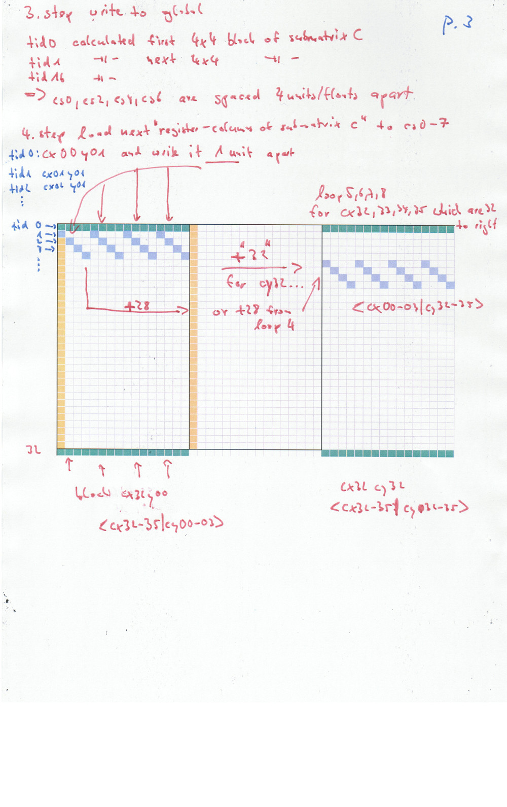

## maxas-explained
-- intro
I'm trying to explain, at least for myself, how Scott Grey's SGEMM works.
E.g. his documentation is missing the FFMA part and more or less the big picture. You really have to look at the real source code to see how the pseudo code gets interleaved/mixed.

### prerequisites:
download cuda 6.5 from nvidias cuda archive (you can extract the runfile with ./cuda_6.5.14_linux_64.run --tar mxvf ;), you need to get cuobjdump and nvdisasm from CUDA 6.5 because it outputs the right format maxas.pl can parse.

### code "compilation-path": 
The main source code is in sgemm64.sass and sgemm128.sass (with more comments).
So maxas.pl uses them to generate the preprocessed version via. It has the same register mappings and register-variable names but with the <SCHEDULED> and <CODE> sections in the final order.
Which means e.g. the first 10 lines after the 3 S2R the sgemm_pre_64.sass are lines 1,10,9,23,26,29,28,20,7,24 from the sgemm64.sass.

The _final versions are how they are in the .cubin files and how they will be executed.

So the pre version is the final version with human-readable register names and comments.
Read the sgemm64.sass for the first lines of code because they are in right order and for the FFMA/texture/shared/global loading/stores read the preprocessed file. And the final files just to check if everything really made it into the .cubin.

### register-bank-C-matrix-mapping

from the sgemm64/sgemm128 code (the perl code section with @cOrder,@swirl) you learn the swirl/back and forth mapping to achieve 47% register cache .reuse is a mapping to the 8x8 C-registers cx<00-03|32-35>y<00-03|32-35> and then those are mapped to the registers 0-63.
E.g. first cOrder is x=2,y=0 which means cx02y00 which is in 3rd row first two entrys 1,0

So you understand why in the _pre_ version the the FFMAs start with cx02y00,cx02y01 (because the perl code produced those without going to the register numbers first). And they will then be translated to actual register numbers when the code is inserted into the .cubin.

### store C sub matrix to global memory
c sub matrix register names =
cx00y00 cx00y01 cx00y02 cx00y03 cx00y32 cx00y33 cx00y34
cx01y00 cx01y02 cx01y03 cx01y03 cx01y32 cx01y33 cx01 y34
and so on.

### quad loading/storing notes
texture index: quad loading from index 0 loads 4 vectors a 4 bytes=16bytes. Loading from index 1 loads the next 4=16bytes
So in the graphic the first green square loads 4 vectors, 16bytes.
shared memory index: bytewise. So don't get confused.

quad loads #1 loading matrix A|B to registers from shared: ld.shared.v4 results in loading to the register and the 3 following ones, so 4 consecutive ones. Loading to j0Ax00 will also load to j0Ax01 j0Ax02 j0Ax03.

quad loads #2 writeCS part: if you use quad-vector store from register it automatically load the following 3 so cs0 results in loading from cs0,cs1,cs2,cs3

### kernel parameters
he used for whatever reason 32bit compilation/pointers. So currently with cuda 8 under linux the code just won't work.

### matrix layout
from the comparision from maxas-sgemm and cublas-sgemm64_nt I figured the layout is non-transpose for A and transpose for B, which seems to be right because both are loaded in column major fashion.

Also I the main.c will print tid to memory adress indexing magic. I just checked how those texture/shared/global loads/writes work. Printing them also in binary form with the int2bin function can help. I just allocated 8192 bytes initialized them with some value overwrote them with other values or the tid accessing them and so on.

 As mentioned that's the confusing part: shared is addressed bytewise vs. quad-texture-unit-wise

 
## The matrix multiplication graphic:

step1: load texture 64x8 A, 8x64 B to shared (B is saved as transpose, so it's loading in the same fashion as from A, so the 64x8 in shared is 8x64 from the not-transposed B)

load 8 registers from A and B with stride 32, because of shared-load-bank-conflicts so you see in the register names 00,01,02,03,32,33,34,35.
for simplicity just look at the the top 4x4 sub-c-matrix: on page.1

c is initialized with 0 so FFMA add to c[x][y] += A_reg-j0[x]*B_reg-j0[y] for x,y from 0 to 3

load one of the 8 next columns to (double-buffer/new registers) A_reg-j1 and next rows to B_reg-j1 and to do the same 64 FFMAs with the same destination c-sub-matrix registers (16 multiplications in 4 sub-matrix-blocks 32 units apart, so 16*4=64 FFMAs in total).

For the 8 columns of A and 8 rows of B already in shared memory you are just computing the basic matrix multiplication rule: row(A)*row(B).

At the beginning of the FFMAs with j0A* and j0B* you load the double-buffer/new-registers j1A* and j1B*. So they are in those registers when the first 64 FFMAs are done (notice write dependency is set and at first use of registers the wait dep is set, so you see where the 64 ffma blocks end/start).

Also in the middle of the 8x64 (8 unrolled) FFMAs texture-load the next 64x8 from A and B to the new shared memory area which starts at 4096 for A and 6144 for B (hence the 4096 XOR to writeC 4byte*(8 A+8 B)*64wide=4096). More precise in the first part loads from texture to registers and than stores to shared, synced with write/wait-dependency control codes.

Each of the 8 unrolled loops uses one line of A,B 64 units wide which are already in shared memory.
So in the pseudo code the loop // process each of our 8 lines from shared
is the unrolled code part.

Towards the end new registers with data from shared A,B are loaded and the unrolled loop with 8*8*8 FFMas starts again. Now using 8 columns/rows of A/B in the double-buffered/different-section-of shared memory.

The dimensions of A,B are not checked here, if texture loads outside of bounds it just return zeros and computes zeros.
The STORE_C part then checks the m,n,k parameters before writing to global memory.

Global memory write on page2 and 3:
short summary: 

 store the 8x8 registers of C to shared memory column by columns:

 store the first column and then read 4 units from the first line and 4 units from line 32 down, written by other threads.

So thread tid 0 writes shared memory[0]      to global [0]       ; tid1 shared[1]      to global[1].
          tid 0 writes shared memory[0+1*64] to global [0+4*1*64]; tid1 shared[1+1*64] to global[1+4*1*64]
	      tid 0 writes shared memory[0+2*64] to global [0+4*2*64]; tid1 shared[1+2*64] to global[1+4*2*64]
  	      tid 0 writes shared memory[0+3*64] to global [0+4*3*64]; tid1 shared[1+3*64] to global[1+4*3*64]
	      tid 0 writes shared memory[32]     to global [32]      ; tid1 shared[1+32]   to global[1+32].

and so on.

Global is spaced 4 apart because tid0 calculated a 4x4block and tid1 the next 4x4 block so what tid0 is reading from shared in the second column is from c-sub-matrix calculated by tid1. The next column from the next 4x4 block

### page2

### page3

 
